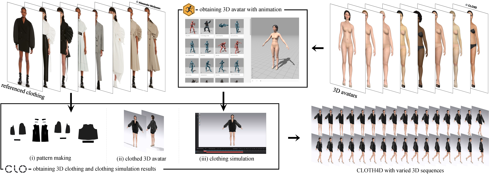

## How to obtain CLOTH4D-type data

    

 
 

:cherries: **CLO3D**   

Option 1: Use your own .zprj file
(1) Select one official avatar of CLO or import an outside avatar (not recommended; in this case, you need to rig the skeleton of the avatar in CLO) 
(2) Adjust the physical appearance of your avatar (if you select the official avatar)
(3) Design the clothing you like
(4) Please remember the pose should be adjust to A pose
(5) Change the mode from "Simulation" to "UV Editor"
(6) Right click, select "reset UV to 2D arrangement", and also "Fit all UV to 0-1"
(7) Export the clothed avatar in OBJ with ZIP file (noted "Unified UV Coordinates (PNG)" checked) --> Texture.zip
(8) Back the mode to "Simulation", delete the clothing, save the naked avatar in fbx file --> A.fbx

Option 2: Use our .zprj file
1. Change the mode from "Simulation" to "UV Editor"
2. Right click, select "reset UV to 2D arrangement", and also "Fit all UV to 0-1"
3. Export the clothed avatar in OBJ with zip file (noted "Unified UV Coordinates (PNG)" checked) --> Texture.zip
4. Back the mode to "Simulation", delete the clothing, save the naked avatar in fbx file --> A.fbx

 

:cherries: **Mixamo**   

(1) Upload the naked avatar, i.e., A.fbx to [Mixamo](https://www.mixamo.com/#/)
(2) Follow the instruction of Mixamo to obtain the animated avatar
(3) Download the animation file in fbx format --> B.fbx

 

:cherries: **Mixamo**   

(1) Import the B.fbx
(2) Adjust the first frame to A pose
(3) Export the file in ABC format --> ani.abc

 

:cherries: **CLO3D**   

(1) Import the ani.abc file in CLO
(2) Adjust your clothes on this abc file
(3) Do clothing simulation
(4) Export the cloth in and(OGAWA) format --> aniclo.abc

 

:cherries: **Blender**   

(1) Import the aniclo.abc in Blender and export the sequences of naked avatar and clothed human avatar, respectively

 

(1) Unzipped the Texture.zip
(2) Copy the inside files to the location of saved sequences obj files
(3) Revise the file name of "convert_to_unified_uv.py" accordingly and run

